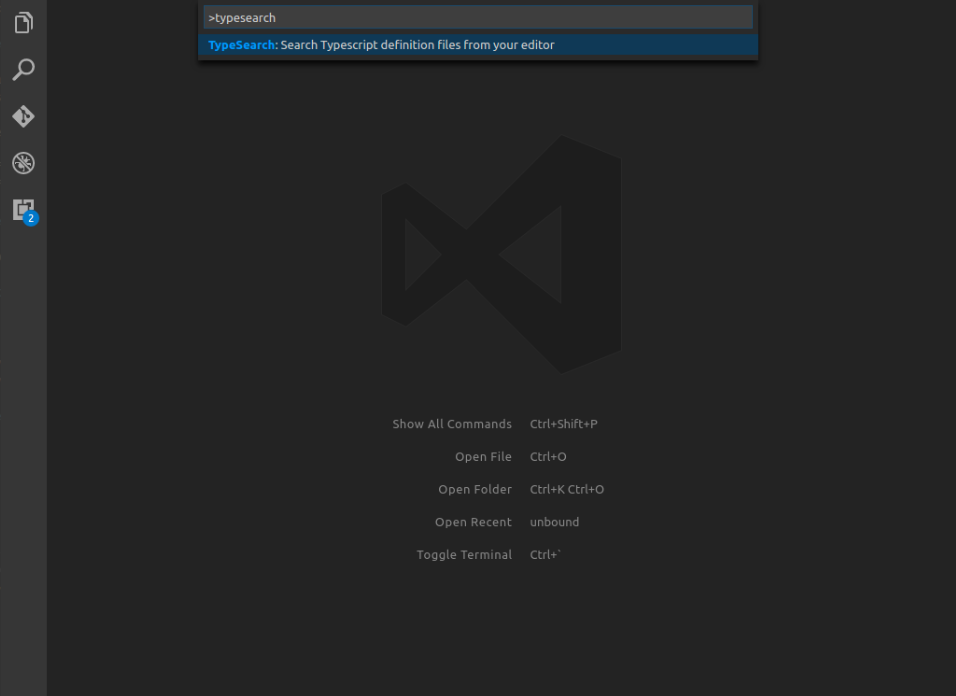
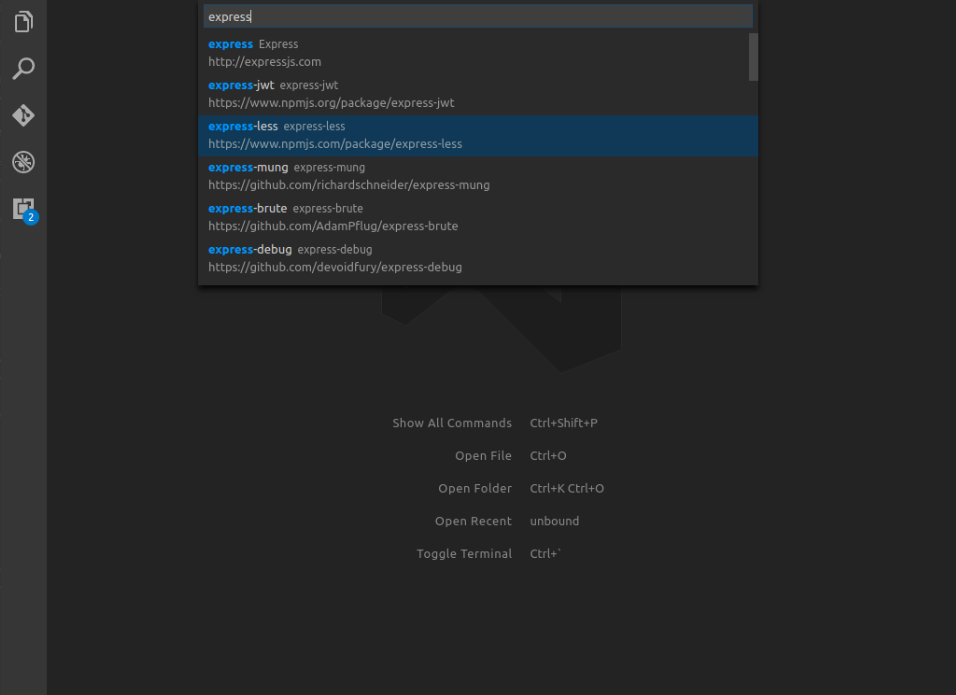

# vscode-typesearch README

Search and install Typescript definition files from your editor

## Features

* Search Typescript definition files
* Install types with NPM or Yarn

For example if there is an image subfolder under your extension project workspace:

## Requirements

None

## Extension Settings (Not yet implemented)

This extension contributes the following settings:

* `typesearch.packageManager`: `NPM|Yarn|None`
* `typesearch.cacheTTL`: ``

## Release Notes

See [Changelog](CHANGELOG.md)